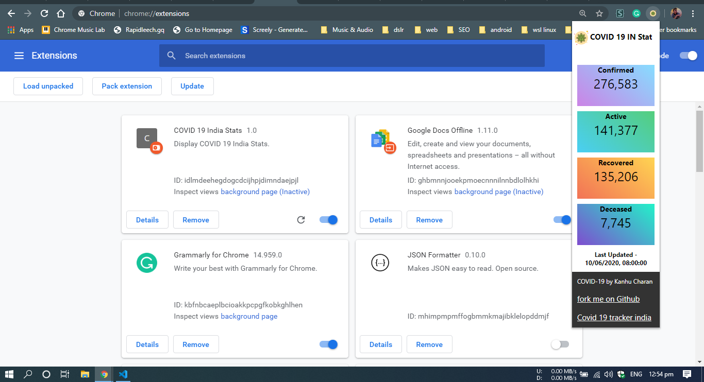

<div style="text-align:center">

</div>

<h1> Covid 19 India Stats `Chrome Extensions`</h1>
<hr>

<hr>
<h3>Installation</h3>

  - [Download](https://github.com/bkanhu/covid-19-in-chrome-extensions/archive/master.zip) the ZIP file to your computer.
  - Go to ```chrome://extensions/``` and check the box for Developer mode in the top right.
  - Extract the previously [downloaded](https://github.com/bkanhu/covid-19-in-chrome-extensions/archive/master.zip) file.
  - Go back to the ```chrome://extensions/``` page and click the **Load unpacked extension** button and select the **unzipped** folder for your extension to **install** it.
  
<!-- From Chrome Web Store: [Covid 19 India Stats Download]() -->
<hr>
special thanks to [icons8](https://icons8.com) for <a target="_blank" href="https://icons8.com/icons/set/coronavirus">Coronavirus icon</a> icon
<hr>
<h3>License</h3> 

MIT © [B Kanhu Charan](https://kanhucharan.me/)
